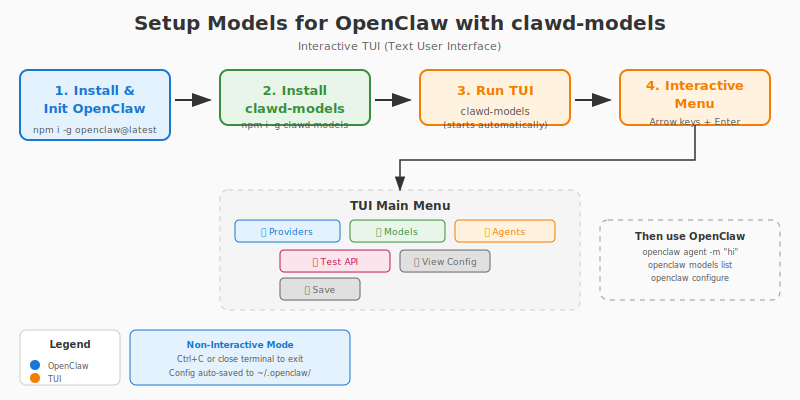

# clawd-models

CLI tool to manage OpenClaw model configurations.

## Quick Start Flow



## Prerequisite
Install and Setup `openclaw` firstly
```
# setup openclaw
openclaw setup 

# or configure it interactively 

openclaw configure
```
Refer to https://github.com/openclaw/openclaw

## Installation

```bash
npm i -g clawd-models
```
Refer to https://github.com/openclaw/openclaw

## Usage

```bash
clawd-models <command> [--bot <openclaw|clawdbot|moltbot>]
# clawd-models help
```

**Global Options:**
- `--bot <bot-id>` - Target bot (openclaw, clawdbot, moltbot). Also saves as default for future commands.
- `--clear-bot` - Clear the default bot setting

**Bot Priority (when --bot not specified):**
1. Saved preference (if set via previous `--bot` use)
2. Auto-detect: openclaw → clawdbot → moltbot

**Config Locations:**
- OpenClaw: `~/.openclaw/openclaw.json`
- ClawdBot: `~/.clawdbot/clawdbot.json`
- MoltBot: `~/.moltbot/moltbot.json`
- Preferred bot: `~/.clawd-models/bot`

**Default Bot Priority:** `openclaw` → `clawdbot` → `moltbot` (auto-selected if not specified via `--bot`)

## Commands

### Core
| Command | Description |
|---------|-------------|
| `init` | Initialize OpenClaw configuration with defaults |
| `view` | View current configuration file and path |
| `edit` | Edit configuration in default editor |
| `import -f <file>` | Import configuration from a JSON config file of `openclaw` |
| `export` | Export configuration to stdout |

### Provider Management
| Command | Description |
|---------|-------------|
| `providers:add -n <name> -u <url> [-k <api-key>]` | Add a new model provider |
| `providers:remove -n <name>` | Remove a model provider |
| `providers:list` | List all configured providers |
Should add a provider firstly, then add a model (refer to next section).

### Model Management
| Command | Description |
|---------|-------------|
| `models:add -p <provider> -i <model-id> --name <name>` | Add a model to a provider |
| `models:remove -p <provider> -i <model-id>` | Remove a model from a provider |
| `models:list [--provider <name>]` | List all configured models |
| `models:test` | Test the default model configuration by sending a test message |

Use `agents:set-default` in next section or refer to `openclaw models set` to set a default model for 'main' and all agents.

Refer to `openclaw agent --agent main -m <message>` to test the default model and agent.

### Agent Management
| Command | Description |
|---------|-------------|
| `agents:add -i <id>` | Add a new agent |
| `agents:remove -i <id>` | Remove an agent |
| `agents:list` | List all configured agents |
| `agents:set-default -a <agent> -m <provider>/<model-id>` | Set default model for an agent type |
Refer to `openclaw agents` and `openclaw agent --help` for more.

### Gateway Management
| Command | Description |
|---------|-------------|
| `gateway:view` | View the Gateway |
| `gateway:refresh-token` | Refresh(regenerate) gateway auth token |
Refer to `openclaw gateway status` for more.

### Auth Profile Management
| Command | Description |
|---------|-------------|
| `auth:add-profile -n <name>` | Add an auth profile |
| `auth:profiles` | List auth profiles configured |

## Configuration Location

`~/.openclaw/openclaw.json`
or
`~/.clawdbot/clawdbot.json`
or
`~/.moltbot/moltbot.json`